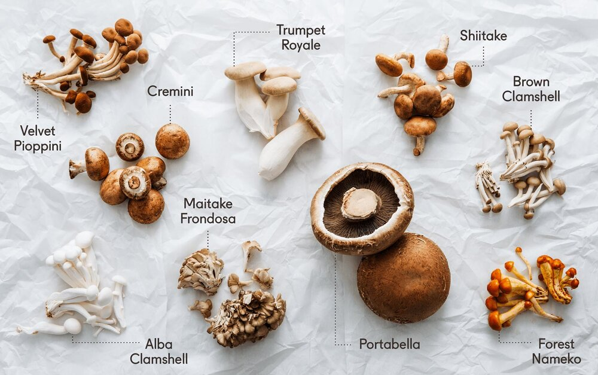

```{r setup, include=FALSE}
knitr::opts_chunk$set(echo = TRUE)
```


```{r, echo=FALSE,fig.align = 'center',out.width="100%",fig.cap="source: https://blog.goodeggs.com/blog/cooking-different-types-of-mushrooms"}

```


Collecting mushrooms recently gained popularity (based on some Instagram influencers and mushroom picking blogs). Since mushrooms come in many different colors and shapes, their fit or unfit for human consumption is not necessarily obvious. Naturally, instead of asking your grandparents for advice a statistical analysis is the way to go to find rules whether a mushroom is edible or poisonous given mushroom attributes concerning the cap, gill and stalk.

### Mushroom attributes
Our main goal is to classify each mushroom into one of the two classes "edible" or "poisonous". For this task we can use various attributes of a mushroom's cap, gill or stalk or attributes like the odor, population or habitat of the mushroom. The cap shape for example can be either "bell", "conical", "convex", "flat", "knobbed" or "sunken" (see figure below). The dataset contains 8124 observations with 22 nominal different features.

```{r, echo=FALSE,out.width="49%", out.height="20%",fig.cap="source: https://www.mushroomdiary.co.uk/mushroom-identification/",fig.show='hold',fig.align='center'}

knitr::include_graphics(c("images/parts-of-a-mushroom.gif","images/cap-shapes.gif"))

```

### Dataset Overview
Variable | Encoding
---------|---------
classes| edible=e,  poisonous=p
cap-shape| bell=b, conical=c, convex=x, flat=f,  knobbed=k, sunken=s  
cap-surface| fibrous=f, grooves=g, scaly=y, smooth=s  
cap-color| brown=n, buff=b, cinnamon=c, gray=g, green=r, pink=p, purple=u, red=e, white=w, yellow=y  
bruises| bruises=t, no=f  
odor| almond=a, anise=l, creosote=c, fishy=y, foul=f, musty=m, none=n, pungent=p, spicy=s  
gill-attachment| attached=a, descending=d, free=f, notched=n  
gill-spacing| close=c, crowded=w, distant=d  
gill-size| broad=b, narrow=n  
gill-color| black=k, brown=n, buff=b, chocolate=h, gray=g, green=r, orange=o, pink=p, purple=u, red=e, white=w, yellow=y  
stalk-shape| enlarging=e, tapering=t  
stalk-root| bulbous=b, club=c, cup=u, equal=e, rhizomorphs=z, rooted=r, missing=?  
stalk-surface-above-ring| fibrous=f, scaly=y, silky=k, smooth=s  
stalk-surface-below-ring| fibrous=f, scaly=y, silky=k, smooth=s  
stalk-color-above-ring| brown=n, buff=b, cinnamon=c, gray=g, orange=o, pink=p, red=e, white=w, yellow=y  
stalk-color-below-ring| brown=n, buff=b, cinnamon=c, gray=g, orange=o, pink=p, red=e, white=w, yellow=y  
veil-type| partial=p, universal=u  
veil-color| brown=n, orange=o, white=w, yellow=y  
ring-number| none=n, one=o, two=t  
ring-type| cobwebby=c, evanescent=e, flaring=f, large=l, none=n, pendant=p, sheathing=s, zone=z  
spore-print-color| black=k, brown=n, buff=b, chocolate=h, green=r, orange=o, purple=u, white=w, yellow=y  
population| abundant=a, clustered=c, numerous=n, scattered=s, several=v, solitary=y  
habitat| grasses=g, leaves=l, meadows=m, paths=p, urban=u, waste=w, woods=d   


```{r,echo=FALSE, message=FALSE, warning=FALSE}
# load packages and data
library(tidyverse)
library(mlr3verse)
library(ranger)
library(gridExtra)
set.seed(123456)

#mushrooms for plotting with different factor lables, mushroom_data for modelling
mushrooms = mushrooms_data = read.csv("Data/mushrooms.csv") %>% 
  select(-veil.type) %>%  # veil.type has only 1 level => omit variable
  mutate(ID = row_number()) # for antijoin operation (test/train split)


mushrooms$class <- factor(mushrooms$class, labels = c("edible", "poisonous"))
mushrooms$odor <- factor(mushrooms$odor, labels = c("almond", "creosote", "foul", "anise", "musty", "none", "pungent", "spicy", "fishy"))
mushrooms$gill.color <- factor(mushrooms$gill.color, 
                         labels = c("buff", "red", "gray", "chocolate", 
                                     "black", "brown", "orange",
                                    "pink", "green", "purple", "white", "yellow"))
```


```{r}
head(mushrooms_data)

summary(mushrooms_data)
```

In order to get a better feeling for our mushrooms let's do some plotting:   
Odor seems to be quite good indicator whether a mushroom is poisonous or edible.   
```{r, echo=FALSE}
p1 <- ggplot(mushrooms, aes(x= odor, fill = class)) +
  geom_bar() +
  theme(legend.position = "bottom", axis.text.x = element_text(angle = 45,  hjust = 1))+
  ggtitle("Distribution of class labels - odor")

p2 <- ggplot(mushrooms, aes(x = gill.color, fill = class)) +
  geom_bar()+
  theme(legend.position = "bottom", axis.text.x = element_text(angle = 45,  hjust = 1))+
  ggtitle("Distribution of class labels - gill.color")

grid.arrange(p1, p2, ncol =2 )

```

### Mushroom Learning
#### Evaluation Framework

Additionally to building a machine learning model for predicting the classes it is crucial to obtain an unbiased generalization error for our estimates. Therefore we decided for a nested resampling strategy where 20% of the dataset is only used for evaluating the model and with a 5-fold CV in inner loop and a 10-fold CV in the outer loop. The number of folds was chosen in a way to balance the bias and variance of our estimate while still considering run time.   

```{r}

# Train Test Split
# Training set for tuning, test set for final evaluation on untouched data
train_test_ratio = .8
mushrooms_data_training = dplyr::sample_frac(tbl = mushrooms_data,
                                             size = train_test_ratio)
mushrooms_data_test = dplyr::anti_join(x = mushrooms_data,
                                       y = mushrooms_data_training,
                                       by = "ID")

mushrooms_data_training = dplyr::select(mushrooms_data_training, -ID)

# Resampling Strategies 
# 5 fold cross validation for inner loop
resampling_inner_5CV = rsmp("cv", folds = 5L)
# 10 fold cross validation for outer loop
resampling_outer_10CV = rsmp("cv", folds = 10L)


```

mlr3 is a machine learning (our in our case mushroom learning) framework offering a common ground for all necessary steps as defining a task, training a learner, predicting new data and resampling.    
A task in mlr3 contains the data as well as meta information such as the name of the target variable or if its a "classification" "regression" task.
```{r}
# Construct Classification Task ------------------------------------------------
task_mushrooms = TaskClassif$new(id = "mushrooms_data_training",
                                 backend = mushrooms_data_training,
                                 target = "class",
                                 positive = "e") # "e" = edible
```


While model tuning will be solely based on the AUC, printing
other measures is useful for assessing the performances for the more relevant error of falsely predicting a poisonous mushroom as edible.   
```{r}
# Performance Measures 
measures = list(
  msr("classif.auc",
      id = "AUC"),
  msr("classif.fpr",
      id = "False Positive Rate"), # false positive rate especially interesting
  # for our falsely edible (although actually poisonous) classification
  msr("classif.sensitivity",
      id = "Sensitivity"),
  msr("classif.specificity",
      id = "Specificity"),
  msr("classif.ce", 
      id = "MMCE")
)

tuner_grid_search = tnr("grid_search")  

measures_tuning = msr("classif.auc")
# Set the budget (when to terminate):
# we test every candidate
terminator_knn = term("evals", n_evals = 50)
terminator_mtry = term("evals", n_evals = 21)


```

#### Choosing algorithms
A relevant property of our dataset is that all features are nominal and thus multinomial distributed. Therefore linear and quadratic discriminant analyses (LDA and QDA) are due to the violated assumption of normally distributed features not possible.    
Following the performance of featureless, naive bayes, KNN, logistic regression, decision tree and random forest models will be compared.     

In the following part we define our inner loop of nested resampling. Only random forest (mtry) and KNN (k) have hyperparameters and will be tuned in a 5-fold-cv.

```{r}

# Autotune knn -----------------------------------------------------------------
# Define learner:
learner_knn = lrn("classif.kknn", predict_type = "prob")

# we want to tune k in knn:
learner_knn$param_set

# tune the chosen hyperparameters with these boundaries:
param_k = ParamSet$new(
  list(
    ParamInt$new("k", lower = 1L, upper = 50)
  )
)

# Set up autotuner instance with the predefined setups
tuner_knn = AutoTuner$new(
  learner = learner_knn,
  resampling = resampling_inner_5CV,
  measures = measures_tuning, 
  tune_ps = param_k, 
  terminator = terminator_knn,
  tuner = tuner_grid_search
)


# Autotune Random Forest ---------------------------------------------------------------------------
# Define learner:
learner_ranger = lrn("classif.ranger", predict_type = "prob", importance = "impurity")

# we tune mtry for the random forest:
learner_ranger$param_set

# we will try all configurations: 1 to 21 features.
param_mtry = ParamSet$new(
  list(
    ParamInt$new("mtry", lower = 1L, upper = 21L)
  ) #sqrt(p) already quite good but how much of
  # an improvement is tuning?
)

# Set up autotuner instance with the predefined setups
tuner_ranger = AutoTuner$new(
  learner = learner_ranger,
  resampling = resampling_inner_5CV,
  measures = measures_tuning, 
  tune_ps = param_mtry, 
  terminator = terminator_mtry,
  tuner = tuner_grid_search
)

learner_tree = lrn("classif.rpart",
                   predict_type = "prob",
                   "cp" = 0.001) 
# setting cp super low to enforce new splits so we get FPR < 1%


learners = list(lrn("classif.featureless", predict_type = "prob"),
                lrn("classif.naive_bayes", predict_type = "prob"),
                learner_tree,
                lrn("classif.log_reg", predict_type = "prob"),
                tuner_ranger,
                tuner_knn
)
print(learners)

```


#### Results
Here the outer loop of nested resampling is done with a 10-fold-cv. 
```{r, message=FALSE, warning=FALSE, results='hide'}
design = benchmark_grid(
  tasks = task_mushrooms,
  learners = learners,
  resamplings = resampling_outer_10CV
)


# Run the models (in 10 fold CV)
bmr = benchmark(design, store_models = TRUE) # takes about 15 minutes


```
First of all we see that no errors or warnings occurred during resampling when printing the benchmark result print(bmr).

```{r}

print(bmr)
```

As expected a featureless model stays at a classification error of close to 0.5.


```{r}
autoplot(bmr)
autoplot(bmr, type = "roc")

tab = bmr$aggregate(measures)
```


```{r}

print(tab)

```


Logistic regression and random forest clearly lead to the best results when ranking the different models by their AUC. 
```{r}
# Ranked Performance------------------------------------------------------------
ranks_performace = tab[, .(learner_id, rank_train = rank(-AUC), rank_test = rank(MMCE))] %>% 
  dplyr::arrange(rank_train)
print(ranks_performace)

```

Here we can inspect our results and compare the true class with our prediction and check which hyperparameters were chosen in which run. 
```{r}

# Predictions knn
result_knn = tab$resample_result[[6]]
as.data.table(result_knn$prediction()) %>% head()

# Model Parameter
knn = bmr$score()[learner_id == "classif.kknn.tuned"]$learner
for (i in 1:10){
  print(knn[[i]]$tuning_result$params)
}

ranger = bmr$score()[learner_id == "classif.ranger.tuned"]$learner
for (i in 1:10){
  print(ranger[[i]]$tuning_result$params)
}
```


With random forests we can asses the importance of each variable in the data. As suspected in the description part odor is clearly a good indicator for edibility of a mushroom.
```{r}
# Variable Importane

filter = flt("importance", learner = learner_ranger)
filter$calculate(task_mushrooms)
feature_scores <- as.data.table(filter)

ggplot(data = feature_scores, aes(x = reorder(feature, -score), y = score)) +
  theme_bw() +
  geom_bar(stat = "identity") +
  ggtitle(label = "Variable Importance Mushroom Features") +
  labs(x = "Features", y = "Variable Importance Score") +
  theme(axis.text.x = element_text(angle = 45, hjust = 1))+
  scale_y_continuous(breaks = pretty(1:500, 10))

```


### Final model
All steps so far answered the question which model with which hyperparameters yields good results with a now known generalization error. However to obtain the best possible model, training with all available data points is needed. We chose the random forest as final model for its interpretability and stability.  


```{r, results = 'hide'}

# Choose the best model and fit on whole dataset ---------------------------------------------------


# train tuner_ranger once again
# since almost all combinations lead to a perfect AUC of 1 we don't need a 
# terminator criterion based on performance or performance stagnation

tuner_ranger = AutoTuner$new(
  learner = learner_ranger,
  resampling = resampling_inner_5CV,
  measures = measures,
  tune_ps = param_mtry, 
  terminator = terminator_mtry,
  tuner = tuner_grid_search
)
tuner_ranger$train(task_mushrooms)

# parameter
tuner_ranger$tuning_instance$archive(unnest = "params")[,c("mtry","AUC")]

tuner_ranger$tuning_result

# use those parameters for model
learner_final = lrn("classif.ranger",predict_type = "prob")
learner_final$param_set$values = tuner_ranger$tuning_result$params
# Train on whole train data
learner_final$train(task_mushrooms)
# Test on never touched test data (20% of whole data splitted at the beginning)
pred = learner_final$predict_newdata(newdata = mushrooms_data_test)
pred$score(measures)

```


